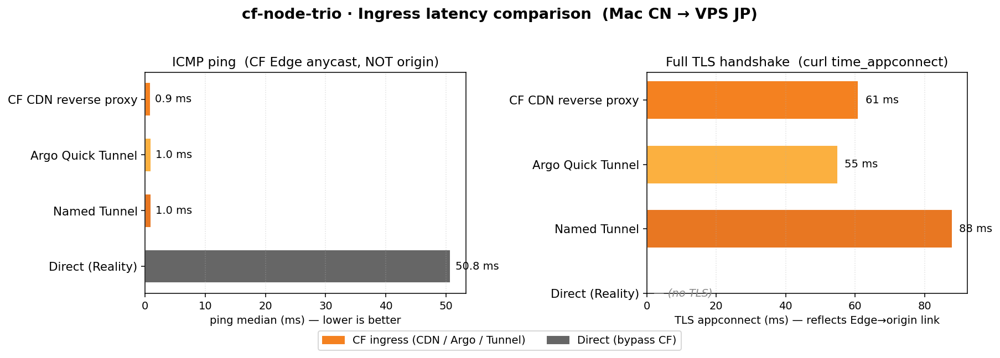

# cf-node-trio

> 一台 VPS 把 4 种协议 + 3 种 Cloudflare 入口装齐. 同一份后端,客户端按需切.
>
> [English](README.en.md)



家里测的, VPS 在日本东京. 怎么读这张图: [bench/results.md](bench/results.md)

## 装

```bash
bash <(curl -fsSL https://raw.githubusercontent.com/birdfly/cf-node-trio/main/install.sh)
```

或者:

```bash
git clone https://github.com/birdfly/cf-node-trio
cd cf-node-trio
sudo bash install.sh
```

跟着菜单走两下,最后会丢出来一条 `vless://...` 链接.

## 协议

`reality` · `ws` · `hy2` · `anytls`

```bash
sudo bash install.sh --proto reality
sudo bash install.sh --proto hy2                          # 普通
sudo HY2_PORT_RANGE=20000:40000 \
     bash install.sh --proto hy2                          # 端口跳跃
sudo HY2_PORT_RANGE=20000:40000 \
     HY2_OBFS=$(openssl rand -hex 8) \
     bash install.sh --proto hy2                          # 端口跳跃 + 混淆
sudo bash install.sh --proto anytls                       # 普通 (自签证书)
sudo ANYTLS_DOMAIN=at.example.com \
     bash install.sh --proto anytls                       # 真域名 → ACME 真证书 (需 DNS 已指向本机, :80 可达)
sudo bash install.sh --proto all                          # 一次装齐
```

## CF 入口 (基于 ws)

`cf-cdn` · `argo` · `tunnel`

```bash
sudo bash install.sh --proto ws --ingress argo            # 不要域名,出节点最快
sudo bash install.sh --proto ws --ingress cf-cdn --domain cdn.example.com
sudo bash install.sh --proto ws --ingress tunnel --domain n.example.com
```

一句话差别:

| | 要域名 | 要 CF 账号 | VPS 开 443 | 子域稳定 |
|---|---|---|---|---|
| cf-cdn | ✓ | ✓ | ✓ | ✓ |
| argo   | ✗ | ✗ | ✗ | ✗ |
| tunnel | ✓ | ✓ | ✗ | ✓ |

详细对比 / 选型建议: [docs/ingress-compare.md](docs/ingress-compare.md)

## 用

```bash
sudo bash install.sh status              # 看现在装了啥
bash install.sh subscribe                # 全部分享链接
bash install.sh subscribe base64         # 订阅链接 (机场格式)
bash install.sh qr all                   # 全部二维码 (ANSI)
sudo bash install.sh port hy2 8443       # 改端口
sudo bash install.sh tune                # 应用 BBR + 大缓冲 + 高并发
sudo bash install.sh uninstall           # 卸载,配置移到备份不直删
```

`tune` 做了什么: BBR+fq, TCP 缓冲 64MB, UDP 缓冲 (Hy2 关键), backlog 65535, nofile 1M, ...
详细每条 + 原理: [docs/tuning.md](docs/tuning.md)

## 测速复现

```bash
bash bench/speedtest.sh \
  --cf-cdn cdn.example.com \
  --argo   xxx.trycloudflare.com \
  --tunnel n.example.com \
  --direct 1.2.3.4:8443
```

数据 + 怎么读这张图: [bench/results.md](bench/results.md)

## 客户端

- Mihomo / Clash Meta: [examples/clash.yaml](examples/clash.yaml)
- sing-box: [examples/sing-box-client.json](examples/sing-box-client.json)

## 文档

- [架构](docs/architecture.md)
- [4 个协议的差别](docs/protocols.md)
- [3 个 CF 入口的差别](docs/ingress-compare.md)
- [内核 / 网络调优](docs/tuning.md)

## 热度

<a href="https://star-history.com/#birdfly/cf-node-trio&Date">
  <picture>
    <source media="(prefers-color-scheme: dark)" srcset="https://api.star-history.com/svg?repos=birdfly/cf-node-trio&type=Date&theme=dark" />
    
  </picture>
</a>

## License

[MIT](LICENSE)
